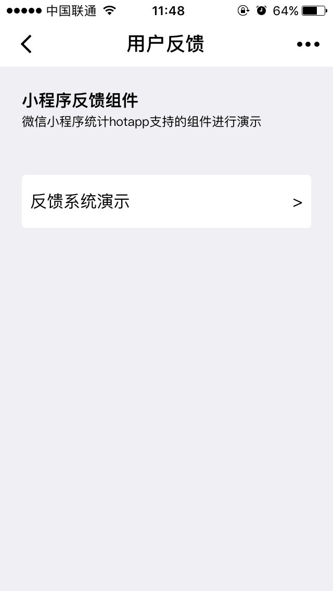
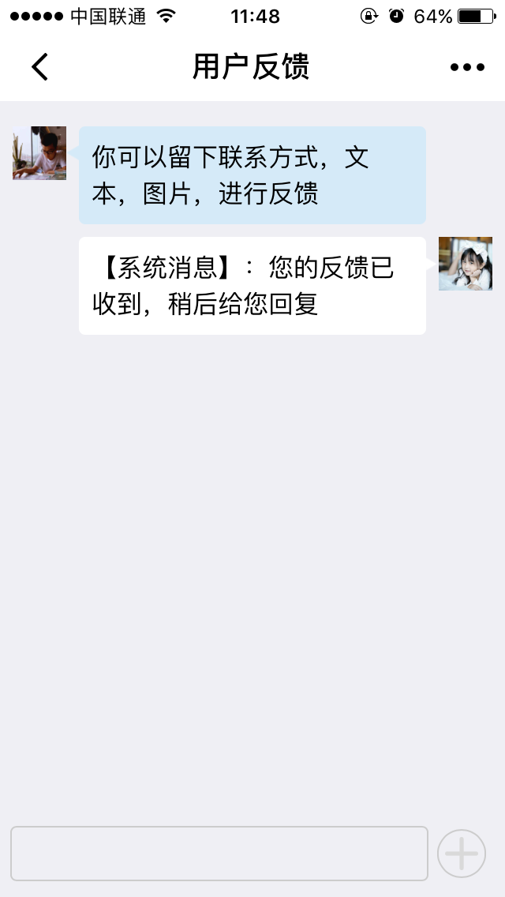
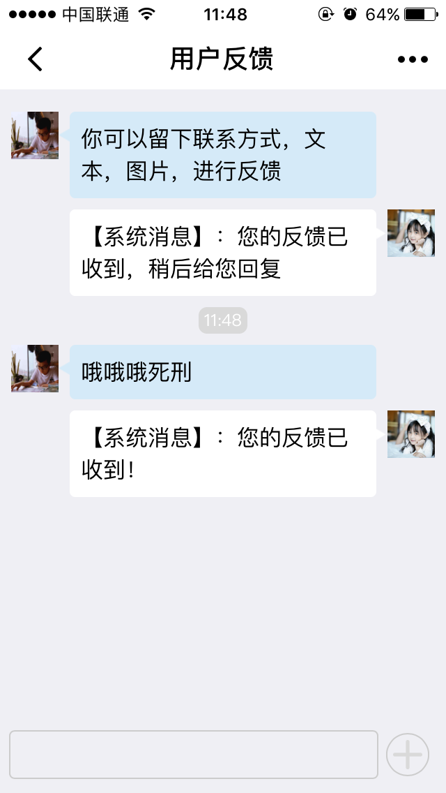
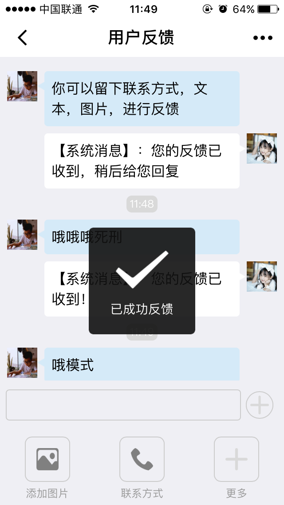
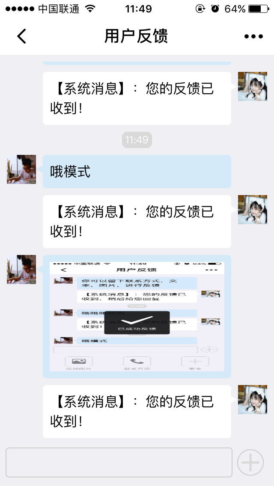
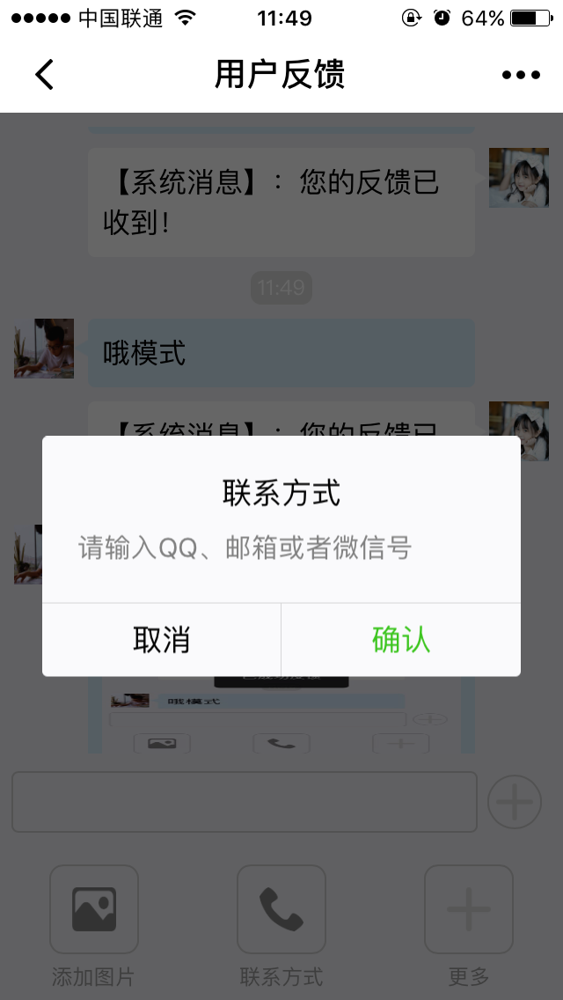
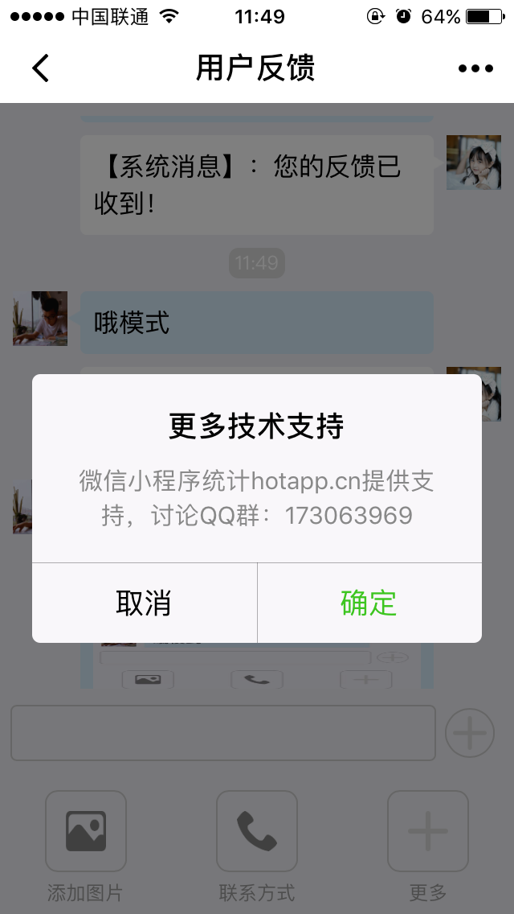

# 微信小程序用户反馈组件--hotapp提供


HotApp云笔记，基于HotApp小程序统计云后台

免费云后台申请地址 https://weixin.hotapp.cn/cloud

API 文档地址：https://weixin.hotapp.cn/api

hotapp小程序技术讨论QQ群：173063969


## 开始使用
### 1.在app.js里onLaunch()初始化hotapp
```
//copyhotapp.js到自己项目中，接入hotapp.js
var hotapp = require('utils/hotapp.js');
//初始化hotapp，使用自己的hotappkey（注册地址：https://weixin.hotapp.cn/api）
hotapp.init('hotapp2427615');
//登录login
hotapp.wxlogin();
```
### 2.在自己项目中引入文件代码

1.images文件（images）

2.feeback页面（page/feedbcak）

3.模板页面（template）

3.按钮代码
```

//js，事件处理函数,跳转到feedback页面
bindViewTap: function () {
    wx.navigateTo({
      url: '../feedback/index'
    })
},
//wxml
<view class="section" bindtap="bindViewTap">
    <view class="button">
      <text>反馈系统演示</text>
   <text>></text>
</view>
```
### 3.你可以hotapp小程序统计后台查看反馈信息（注意关联好自己hotappkey）

## 功能展示








